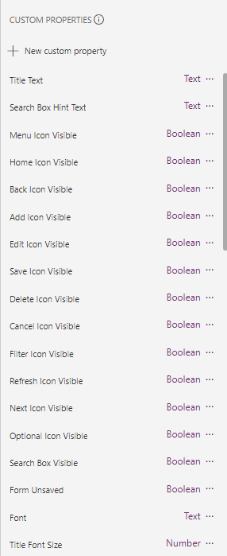
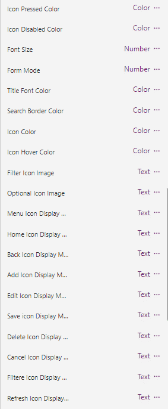
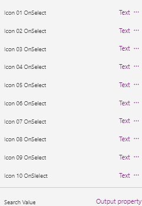

# Screen Header with Icons
> Header with Search text box, configurable icons and screen/app title label

Common editing and navigation icons. Most colors are editable. Icons such as Add New, Save, Delete, Back, etc. You can show/hide most controls and use behavior properties such as OnSelect.
Brief explanations on usage are in the comments of properties.

New version has generic icons where you can define the image and be able to change the image in the app on the fly in a table (see below).
You can now add labels below the icons and the hover text will match the labels. See sample code in comments.
- Configurable icons & icon titles
- Search box
- Screen title
### Image & Label Table
<
// Set the icon label text & image
// Use in-app variables for IconImage or IconText if needed
Table(
    {
        IconText: "Menu",
        IconID: "Icon_01",
        IconImage: Icon.Hamburger
    },
    {
        IconText: "Home",
        IconID: "Icon_02",
        IconImage: Icon.Home
    },
    {
        IconText: "Back",
        IconID: "Icon_03",
        IconImage: Icon.BackArrow
    },
    {
        IconText: "New",
        IconID: "Icon_04",
        IconImage: Icon.Add
    },
    {
        IconText: "Edit",
        IconID: "Icon_05",
        IconImage: Icon.Edit
    },
    {
        IconText: "Submit",
        IconID: "Icon_06",
        IconImage: Icon.Save
    },
    {
        IconText: "Delete",
        IconID: "Icon_07",
        IconImage: Icon.Trash
    },
    {
        IconText: "Cancel",
        IconID: "Icon_08",
        IconImage: Icon.CancelBadge
    },
    {
        IconText: "Filter",
        IconID: "Icon_09",
        IconImage: Icon.FilterFlat
    },
    {
        IconText: "Refresh",
        IconID: "Icon_10",
        IconImage: Icon.Reload
    }
)
>
### Custom Properties
|  |  |  | 
