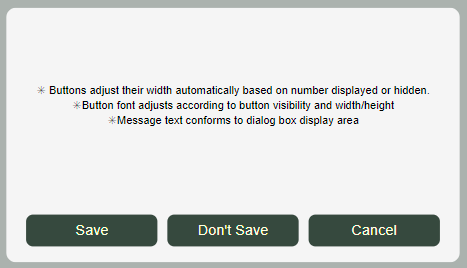

# Modal Dialog with Configurable Buttons

Note: The latest update addreses the "One or more component behaviour properties, event or action, have a mismatched return type" error.

### Responsive Design:
- Buttons adjust their width automatically based on number displayed or hidden.
- Button font adjusts according to button visibility and width/height
- Message text conforms to dialog box display area
### Configurable Options:
- Dialog box:
  - Message (with variables)
  - Fill color
- Buttons:
  - Visibility
  - OnSelect
  - Text per button
  - Fill color
  - Font color
