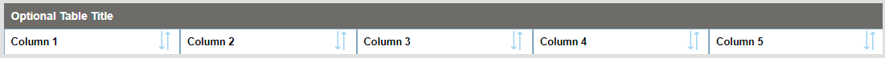
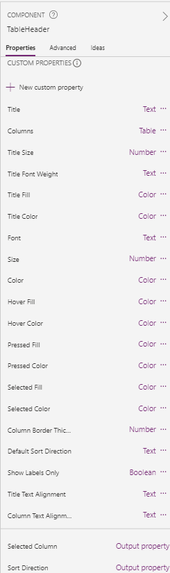

# Responsive Table Header
> Table header with responsive, sortable columns

KUDOS: I've based this component on Jamie Willis-Rose's [Flexible Width Gallery](https://willisrose.com/power-apps-tip-flexible-width-gallery/).
I have made some additions such as sorting icons, column text alignment, etc.
As for the explanation on how this entire thing works, I have some comments within the component, but Jamie says it all in his excellent article.
Thanks Jamie. I've used this in many a canvas app.

### Custom Properties

